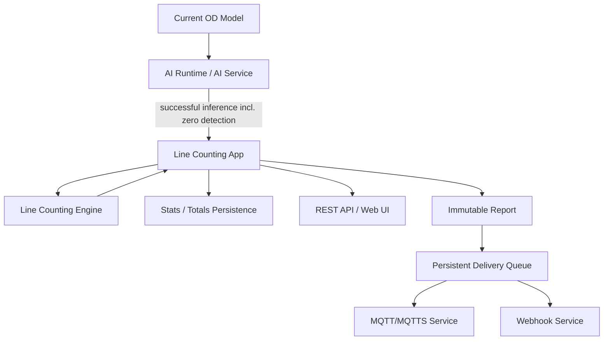
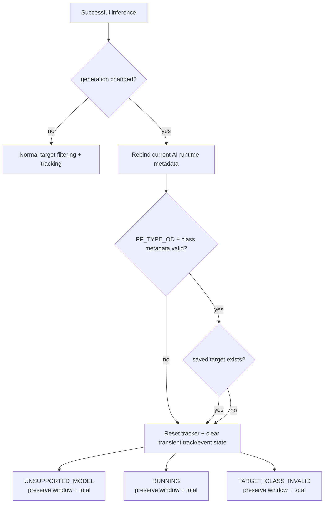
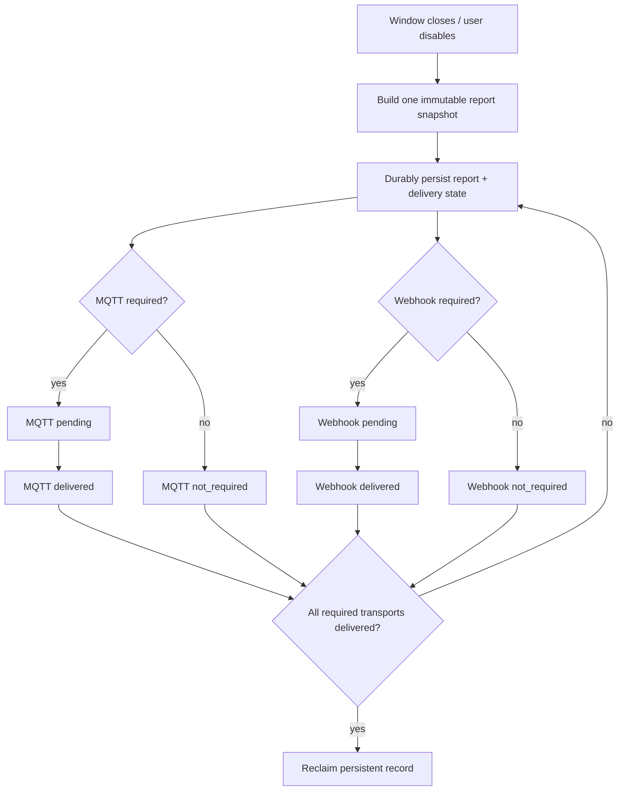
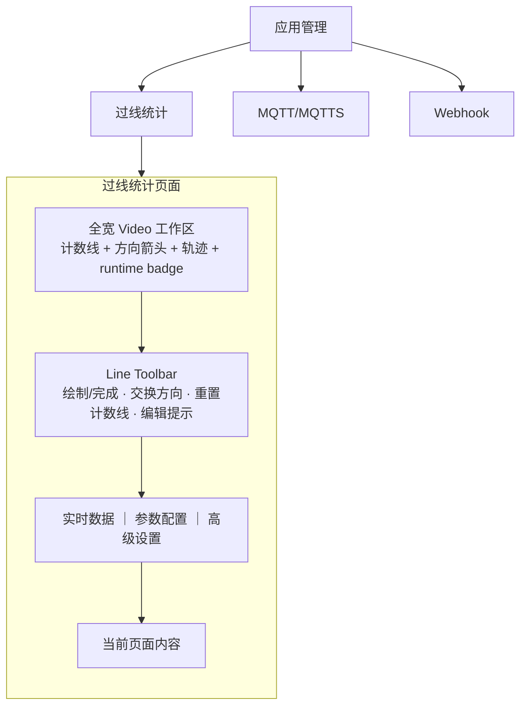

# Line Counting 泛化设计

- 日期：2026-09-21
- 仓库：`harryhua-ai/ne301`
- 目标分支：`counting`
- 状态：Design approved，implementation 尚未开始

## 1. 背景与目标

现有 People Counting 实现围绕“person”业务命名与配置组织，但核心能力本质上是：

1. 消费当前 Object Detection 模型输出；
2. 对指定类别目标做中心点跟踪；
3. 判断轨迹是否跨越计数线；
4. 按方向累计 IN / OUT；
5. 按统计窗口生成报告并通过 MQTT / Webhook 投递。

本设计将该能力泛化为 **Line Counting / 过线统计**。V1 支持任意当前已加载的 Object Detection 模型，只统计用户选定的单一 target class。People Counting 作为旧接口与旧配置的兼容入口，不再作为长期内部架构。

### 1.1 V1 范围

V1 支持：

- 单 Line Counting 实例；
- 单 target class；
- 单条计数线；
- Object Detection 模型（`PP_TYPE_OD`）；
- 中心点轨迹跟踪与 IN / OUT 过线统计；
- 当前周期与累计统计；
- MQTT / Webhook 周期上报；
- 持久化 delivery queue；
- 旧 People Counting 配置、totals、REST 路径的兼容迁移或适配；
- Web UI 集成到“应用管理”。

V1 不支持：

- 多 class 同时统计；
- 多 Line Counting 实例；
- ROI；
- occupancy；
- Kalman / Hungarian / IoU 等新 tracker；
- Line Counting 页面主动加载或切换模型；
- 每次过线即时上报独立 event report。

## 2. 核心设计原则

### 2.1 业务与模型解耦

Line Counting 的业务身份是：

```text
counter_name + target_class
```

模型是算法运行上下文，不是统计 session 或 window 的边界。

因此，只要 target class 业务含义不变，用户替换模型时：

- 当前 window 不清零；
- 累计 total 不清零；
- window 起点不改变；
- report 周期不改变；
- tracker 必须 reset，以避免跨模型 bbox/中心点关联；
- recent events 与 pending track records 清理；
- 新模型仍支持 target 时继续 RUNNING。

### 2.2 Line Counting 不拥有模型

Line Counting 页面和业务层只消费当前 AI Runtime：

- 不加载模型；
- 不卸载模型；
- 不切换模型；
- 不保存 editable `model_name` / `model_pp_type`；
- 当前模型在 UI 中只读展示。

模型切换继续由现有 Model Management / AI Service 机制完成。

### 2.3 统计与传输解耦

统计窗口、累计统计和 transport 的生命周期独立。

MQTT/Webhook 开关只决定：

- 新 report 是否需要该 transport 投递；
- 对应 backlog 是否继续 drain。

transport 的 enable/disable 不暂停统计窗口，也不改变 IN/OUT 统计。

## 3. 总体架构

```text
                    Current AI Model
                          │
                    successful inference
                          │
                          ▼
                    AI Service
              ┌───────────┴───────────┐
              │ runtime model info    │
              │ result subscription   │
              └───────────┬───────────┘
                          ▼
                 Line Counting App
              ┌───────────────────────┐
              │ model binding         │
              │ target filtering      │
              │ window / total stats  │
              │ persistence           │
              │ reporting             │
              │ REST / UI state       │
              └───────────┬───────────┘
                          │ centers[]
                          ▼
                Line Counting Engine
              ┌───────────────────────┐
              │ centroid tracker      │
              │ line crossing         │
              │ direction anti-bounce │
              │ track records         │
              └───────────────────────┘
```

推荐内部命名：

- `pc_types.h` → `lc_types.h`
- `pc_tracker.h/.c` → `lc_tracker.h/.c`
- `pc_line_cross.h/.c` → `lc_line_cross.h/.c`
- `people_counting.h/.c` → `line_counting.h/.c`
- `pc_backlog.h/.c` → generic persistent delivery implementation，命名以最终模块边界为准

`lc` 表示 Line Counting。

旧 `pc_*` 可以在兼容期保留 adapter，但新业务代码不得继续依赖 People Counting 命名扩展。

### 3.1 总体架构图



## 4. AI Runtime 扩展

NE301 已有 AI/Model Runtime 基础设施：

- `nn_model_info_t`
- `video_ai_node`
- `ai_service`
- `ai_get_model_info()`
- `ai_service_get_model_info()`
- `ai_reload_model()`

因此本设计不新增平行 Model Runtime，而是采用“方案 C”：分层扩展现有 runtime。

### 4.1 `nn_model_info_t` 只保存固有 metadata

建议增加：

```c
char model_type[32];
uint16_t num_classes;
```

`nn.c::load_info()` 从模型配置解析：

- `model_info.type`
- `postprocess_params.num_classes`

不在 `nn_model_info_t` 中暴露 postprocessor 私有的 `char **class_names`，也不保存 `generation`。

### 4.2 class list 生命周期

Postprocessor 当前可以从模型 metadata 解析 `class_names`，但这些字符串属于 postprocessor 私有 context。

AI Runtime 必须持有一份生命周期稳定的 selectable class list，使业务层不会借用 postprocessor 私有指针。

对外暴露的是：

> 可检测、可被业务选择的 foreground classes。

Line Counting 与 Web UI 不得通过字符串规则猜测 `background`、`bg`、`__background__` 等特殊类别。

如果 runtime 无法可靠确定 selectable classes，则 class metadata 视为不可用。

### 4.3 Runtime API

概念接口：

```c
typedef struct {
    aicam_bool_t loaded;
    nn_state_t nn_state;
    char name[64];
    char version[32];
    char model_type[32];
    char postprocess_type[32];
    pp_type_t result_type;
    uint16_t num_classes;
    uint32_t generation;
} ai_model_runtime_info_t;

aicam_result_t ai_get_model_runtime_info(ai_model_runtime_info_t *info);
aicam_result_t ai_get_model_class_count(uint16_t *count);
aicam_result_t ai_get_model_class_name(
    uint16_t index,
    char *buf,
    size_t buf_size);
```

具体函数名允许实现阶段按现有 AI Service 风格调整，但语义必须保持：

- read-only；
- class name 的所有权属于 AI Runtime；
- 调用者拿 copy，不持有内部裸指针；
- `generation` 只表示当前 boot 内成功 load/reload 的模型代次。

### 4.4 支持判断

Line Counting 判断是否支持当前模型时，以：

```text
result_type == PP_TYPE_OD
```

为准。

不得通过字符串匹配 `postprocess_type` 推断模型类型。

如果：

- 当前模型不是 OD；
- `num_classes == 0`；
- class count 与 metadata 不一致；
- class name 不可用；

则 runtime 进入 `unsupported_model`，reason 可为：

```text
class_metadata_unavailable
```

不得猜测 target class。

## 5. AI Result Subscription 与模型变化检测

### 5.1 successful inference 必须全部通知

当前旧 subscriber fan-out 依赖 draw callback，并且只在检测结果非空时通知。这会造成 zero-detection frame 丢失。

Line Counting tracker 需要每次 successful inference，包括：

```text
nb_detect == 0
```

否则：

- `miss_count` 不增长；
- track 不退休；
- tracker 状态与现实帧序列脱节。

设计要求将 result subscription 语义提升为真正的 post-inference event source。

推荐路径：

```text
video_ai_node successful inference
        ↓
AI Service result fan-out
        ├─ Line Counting
        └─ future consumers
```

不能依赖“有框才执行”的绘图逻辑。

### 5.2 模型 generation

`model_generation` 属于当前 AI Runtime，而不是模型包 metadata。

规则：

- 只在模型 load/reload 成功完成后递增；
- reload 开始时不递增；
- load 失败时不伪造新 generation。

Line Counting 在每次 successful inference 上进行：

```text
current_generation == cached_generation ?
    yes → 正常处理
    no  → rebind current model
```

正常 hot path 只允许 O(1) generation read + compare。

性能约束：

> Line Counting MUST NOT parse model JSON in the inference path. Class metadata MUST be resolved only on model load/change. Normal inference path MUST only perform an O(1) generation check before detection filtering/tracking.

V1 不增加独立 model-change callback。

### 5.3 模型切换与 Runtime 状态图



模型切换只改变算法运行上下文，不形成新的统计 window 或 session 边界。

## 6. Line Counting Engine

Engine 只负责算法，不知道以下业务概念：

- model；
- target class；
- counter name；
- MQTT；
- Webhook；
- report window；
- persistence。

输入：

```text
centers[] + timestamp
```

配置只包含算法字段：

- line geometry；
- outside reference point；
- max association distance；
- track history length；
- max miss；
- confirmation frames。

### 6.1 Tracker

V1 保持当前 centroid tracker 方向：

- bbox center；
- greedy association；
- Euclidean max distance；
- fixed-size/ring history；
- max miss retirement；
- deterministic processing order；
- direction anti-bounce。

不引入：

- Kalman；
- Hungarian；
- IoU tracker。

### 6.2 稳定性修正

必须修正：

- confirmation/age counter 饱和，不允许 `uint8_t` 无声溢出；
- 删除或修正不可靠的冗余 active count；
- zero-detection frame 正常推进 miss；
- 不定义 `LC_REALLOC`；
- 所有“扩容”使用显式 `malloc → memcpy → free`。

这是针对当前 firmware `hal_mem_realloc` 不复制旧内容的明确防护。

## 7. 配置模型

canonical config 概念结构：

```c
typedef struct {
    aicam_bool_t enable;

    char counter_name[64];
    char target_class_name[32];

    uint16_t line_x1_permille;
    uint16_t line_y1_permille;
    uint16_t line_x2_permille;
    uint16_t line_y2_permille;
    uint16_t outside_x_permille;
    uint16_t outside_y_permille;

    uint16_t conf_threshold_permille;

    uint16_t max_dist_permille;
    uint8_t track_history_k;
    uint8_t max_miss;
    uint8_t k_confirm;

    uint16_t window_minutes;

    bool mqtt_report_enable;
    bool webhook_report_enable;
    bool tracks_report_enable;
    bool heat_grid_enable;
    uint16_t backlog_capacity;
} line_counting_config_t;
```

不保存：

- `model_name`；
- `model_pp_type`；
- `class_names`；
- `model_generation`；
- runtime state。

默认 `counter_name`：

```text
客流统计
```

用于兼容原 People Counting 业务体验。

## 8. 配置校验与原子应用

必须区分：

```text
配置合法性
!=
当前运行条件是否满足
```

因此，当前模型暂时不是 OD 时，一个语法和范围合法的：

```json
{"enable": true}
```

仍允许保存，只是 runtime 进入 `unsupported_model`。

### 8.1 配置校验

至少验证：

- `counter_name` UTF-8 与最大长度；
- `target_class` 长度与合法字符串；
- line 所有坐标在 `[0.0, 1.0]`；
- line 两端点不能重合；
- outside point 合法；
- `confidence_threshold` 在 `[0.0, 1.0]`；
- `association_distance` 在 `[0.0, 1.0]`；
- history/max miss/confirmation/window/backlog 均有明确上下限。

具体数值上限在 implementation plan 中根据现有内存与算法结构固化，不在设计阶段随意扩大。

### 8.2 target class 主动变更

用户主动 POST 一个新的 target class 时，必须确认它存在于**当前模型的 selectable class list**。

不存在时：

```text
422 invalid_target_class
```

而外部模型切换后导致已保存 target 失效，则：

- 不修改 persisted config；
- runtime → `target_class_invalid`；
- statistics 保留。

### 8.3 原子 apply

流程：

```text
parse complete JSON
    ↓
validate complete object
    ↓
compute change set
    ↓
prepare new resources
    ↓
persist config
    ↓
commit/swap active config
    ↓
apply reset/rebuild semantics
```

若任一步失败：

> 旧配置必须继续完整生效。

禁止出现“部分字段已更新、部分失败”的半应用状态。

## 9. Runtime State

核心状态：

```text
disabled
running
unsupported_model
target_class_invalid
```

可通过 `reason` 提供更细原因，例如：

```text
class_metadata_unavailable
model_not_loaded
```

`enable` 表示用户意图；runtime state 表示实际运行能力。

## 10. 统计语义

实时统计：

- 本周期进入；
- 本周期离开；
- 累计进入；
- 累计离开。

不提供 occupancy。

### 10.1 模型切换

模型切换但 target 仍存在：

- tracker reset；
- pending tracks clear；
- recent events clear；
- current window IN/OUT 保留；
- cumulative total 保留；
- window start 保留；
- report schedule 保留；
- 继续 RUNNING。

模型切换后 target 不存在：

- tracker reset；
- recent events clear；
- current window/total/window clock 保留；
- runtime → `target_class_invalid`；
- 不提前结算；
- 不清零。

换回支持该 target 的模型后自动继续。

### 10.2 target class 改变

这是新的统计 session。

必须先确认，再执行完整 reset：

- current window IN/OUT → 0；
- total IN/OUT → 0；
- tracker → clear；
- pending tracks → clear；
- recent events → clear；
- heat grid → clear；
- current window start → now；
- persisted totals → 0；
- persistent delivery queue → durable clear。

### 10.3 counter_name 改变

只改变后续业务标识：

- 不清 window；
- 不清 total；
- 不清 tracker；
- 不清 backlog。

历史 immutable report 保留原 counter_name。

### 10.4 runtime 暂停

如果 `enable=true`，但模型暂时 unsupported 或 target invalid：

- tracker 不工作；
- crossing 不增加；
- window timer 继续按真实时间滚动；
- 到期仍正常结算该窗口。

统计周期表示 wall-clock duration，不是“累计 inference 运行时间”。

### 10.5 用户主动 disable

用户设置 `enable=false` 时：

1. 立即正常结算当前未完成 window；
2. 若 transport 开启，生成最后一条 report；
3. tracker clear；
4. recent events clear；
5. 不再启动新 window；
6. total 保留；
7. existing persistent backlog 保留。

再次 enable 时从当前时刻创建新的 window。

disable 不是 reset。

## 11. 最近事件

设备内维护 RAM ring，容量 50。

内部可包含：

```c
typedef struct {
    uint32_t sequence;
    uint32_t timestamp_ms;
    uint32_t track_id;
    lc_direction_t direction;
} line_count_event_t;
```

特点：

- reboot 后消失；
- reset 后清空；
- target class 变更后清空；
- model change 时清空；
- UI 默认只显示相对时间 + IN/OUT；
- track id/sequence 主要供 API/debug 使用。

## 12. Reporting Schema

每个统计窗口生成一个 immutable Line Counting report。

示例：

```json
{
  "schema_version": 1,
  "type": "line_counting",

  "device_id": "xx:xx:xx:xx:xx:xx",
  "boot_id": 386271,
  "report_seq": 128,

  "clock_valid": true,
  "reported_at": "2026-09-17T10:42:15.123Z",

  "counter_name": "正门客流",

  "window": {
    "start_time": "2026-09-17T10:37:15.000Z",
    "end_time": "2026-09-17T10:42:15.000Z",
    "duration_sec": 300,
    "in": 38,
    "out": 21
  },

  "total": {
    "in": 1264,
    "out": 1189
  },

  "target": {
    "class_name": "person"
  },

  "model": {
    "name": "person_yolo_v2",
    "version": "2.0.0"
  },

  "line": {
    "x1": 0.20,
    "y1": 0.50,
    "x2": 0.80,
    "y2": 0.50,
    "outside_x": 0.50,
    "outside_y": 0.20
  },

  "config": {
    "confidence_threshold": 0.50
  }
}
```

### 12.1 model 字段语义

`model` 只表示：

> report 生成时设备当前加载的模型。

不记录：

- window 开始模型；
- 模型切换历史；
- switch count；
- runtime generation。

模型切换本身对业务 report 没有特殊意义。

### 12.2 optional blocks

`tracks_report_enable=false` 时完全省略 `tracks`。

开启时可包含最多受保护上限约束的 track records。

`heat_grid_enable=false` 时完全省略 `heat_grid`。

开启时发送 bounded heat grid。

所有坐标对外使用 normalized `[0.0, 1.0]`，不暴露 MCU permille。

### 12.3 Report identity

每条 report 使用：

```text
device_id + boot_id + report_seq
```

作为幂等 identity。

`report_seq`：

- boot 内单调递增；
- report 第一次生成后固定；
- retry 不重新编号；
- reboot 后可以从新 boot 的起点重新计数。

一条 report enqueue 后，以下字段不可修改：

- payload；
- `boot_id`；
- `report_seq`；
- timestamps；
- window stats；
- target/model metadata；
- line/config snapshot。

## 13. 时间规范

### 13.1 内部时间

tracker、timeout、window scheduler、recent event 相对时间使用：

```text
monotonic / uptime
```

### 13.2 外部业务时间

MQTT/Webhook 使用 ISO 8601 UTC：

```text
YYYY-MM-DDTHH:mm:ss.sssZ
```

例如：

```text
2026-09-17T10:42:15.123Z
```

不发送无时区本地时间字符串。

### 13.3 clock invalid

RTC/NTP 不可信时仍允许发送统计数据，但：

```json
{
  "clock_valid": false,
  "reported_at": null,
  "window": {
    "start_time": null,
    "end_time": null,
    "duration_sec": 300
  }
}
```

不得：

- 用 uptime 冒充 Unix/UTC；
- 用 `1970-01-01` 伪装有效时间。

## 14. MQTT / Webhook 语义

Line Counting 不定义 MQTT topic，也不拼接业务专用 topic。

职责：

```text
Line Counting
    ↓
生成 line_counting payload
    ↓
MQTT Service / Webhook Service
    ↓
使用现有 transport 配置
```

MQTT/MQTTS topic 跟随现有 MQTT 配置。

Webhook endpoint 跟随现有 Webhook 配置。

两个 transport 使用完全相同的 immutable payload。

### 14.1 transport enable/disable

某 transport 被关闭时：

- 不为新 report 创建该 transport 的 delivery obligation；
- 暂停该 transport 已有 backlog 的 drain；
- 已有 backlog 不删除。

重新开启后：

- 继续 drain 原 backlog；
- 新 report 正常加入该 transport。

统计窗口本身继续滚动。

## 15. Persistent Delivery Queue

V1 backlog 必须持久化，不能只存在 RAM。

### 15.1 数据模型

每个业务 report 只持久化一份 immutable payload：

```text
Persistent Report
├─ immutable payload
├─ MQTT: pending / delivered / not_required
└─ Webhook: pending / delivered / not_required
```

例如 report 生成时：

```text
MQTT enabled
Webhook disabled

→ MQTT = pending
→ Webhook = not_required
```

未来重新打开 Webhook 时，不补发历史上本来就 not_required 的 report。

### 15.2 回收规则

只有所有 required transport 都 delivered 后，该 report 才允许被回收。

例如：

```text
MQTT delivered
Webhook pending

→ record 必须保留
```

### 15.3 持久化要求

Persistent Delivery Queue 必须满足：

1. bounded；
2. crash-consistent；
3. record integrity check；
4. immutable payload；
5. persistent delivery state；
6. FIFO delivery；
7. count limit；
8. byte limit；
9. drop-oldest；
10. reset 可持久清空。

每个 record 至少需要可靠识别 incomplete/corrupt write，例如 length + checksum/CRC，具体格式由 implementation plan 决定。

### 15.4 enqueue durable ordering

语义：

```text
build immutable report
    ↓
durably persist report
    ↓
record becomes visible to delivery worker
    ↓
attempt MQTT/Webhook
```

掉电发生在未完成 record 写入时：

- reboot recovery 必须识别并丢弃 incomplete record；
- 不得将半条 payload 当作有效 report。

### 15.5 容量

用户配置：

```text
backlog_capacity = 最大 report 数量
```

系统还必须有内部 byte limit：

```text
persistent_backlog_max_bytes
```

队列同时满足：

```text
count <= backlog_capacity
AND
bytes <= persistent_backlog_max_bytes
```

任一限制触发时：

- drop oldest pending report；
- dropped counter 增加。

因为 tracks/heat grid 可能显著扩大单 report 大小，所以只限制 report 数量不够。

### 15.6 存储错误

新 report 无法持久化时：

- Line Counting 继续运行；
- 当前统计不停止；
- report 计入 dropped/error；
- storage/delivery fault 通过 stats/status 暴露。

telemetry storage 故障不得拖垮核心 counting。

### 15.7 reboot

重启后：

- 恢复旧 report 原 payload；
- 保留旧 `boot_id`；
- 保留旧 `report_seq`；
- 保留旧 timestamps；
- 恢复 MQTT/Webhook pending 状态；
- 继续 retry。

当前新 boot 使用新的 `boot_id` 和自己的 `report_seq` 序列。

### 15.8 Report 与 Persistent Delivery Queue 数据流图



同一统计 window 只生成一份 payload；MQTT 与 Webhook 共享该 immutable payload，仅 delivery state 独立持久化。

## 16. 持久化边界

### 16.1 Persist

必须持久化：

- canonical line-counting config；
- cumulative totals；
- persistent delivery queue。

建议 totals 独立于 config，例如：

```text
/config/line_counting_totals.json
```

实际文件/NVS 位置由现有 persistence architecture 决定。

### 16.2 不持久化

不恢复：

- current window counts；
- tracker；
- recent events；
- heat grid；
- pending transient track records。

reboot 后：

- total 恢复；
- current window 从 0 开始；
- tracker 新建；
- events empty；
- heat grid empty。

## 17. REST API

canonical API：

```text
GET  /api/v1/apps/line-counting/config
POST /api/v1/apps/line-counting/config

GET  /api/v1/apps/line-counting/status
GET  /api/v1/apps/line-counting/stats
GET  /api/v1/apps/line-counting/events

POST /api/v1/apps/line-counting/reset
```

### 17.1 `/config`

使用 product-level normalized values：

```json
{
  "enable": true,
  "counter_name": "正门客流",
  "target_class": "person",

  "line": {
    "x1": 0.2,
    "y1": 0.5,
    "x2": 0.8,
    "y2": 0.5,
    "outside_x": 0.5,
    "outside_y": 0.2
  },

  "confidence_threshold": 0.5,

  "tracking": {
    "association_distance": 0.25,
    "history_length": 8,
    "max_missed_frames": 5,
    "confirmation_frames": 5
  },

  "window_minutes": 5,

  "reporting": {
    "mqtt_enabled": true,
    "webhook_enabled": false,
    "tracks_enabled": true,
    "heat_grid_enabled": false,
    "backlog_capacity": 24
  }
}
```

REST 不暴露：

- `*_permille`；
- internal C field naming。

API module 负责 normalized ↔ firmware internal representation 转换。

### 17.2 `/status`

示例：

```json
{
  "enabled": true,
  "state": "running",
  "reason": null,

  "target_class": "person",

  "model": {
    "name": "Person Tiny",
    "version": "1.0.0",
    "type": "OBJECT_DETECTION",
    "result_type": "od",
    "postprocess_type": "pp_od_yolo_v11_ui",
    "generation": 3,
    "classes": [
      {"id": 0, "name": "person"}
    ]
  }
}
```

这里的模型信息必须来自 AI Runtime，不由 Line Counting 自己 parse JSON。

`generation` 可以在 status 暴露给诊断/UI，但不进入业务 report。

### 17.3 `/stats`

示例：

```json
{
  "window": {
    "in": 38,
    "out": 21
  },
  "total": {
    "in": 1264,
    "out": 1189
  },
  "delivery": {
    "mqtt": {
      "backlog": 0,
      "dropped": 0
    },
    "webhook": {
      "backlog": 2,
      "dropped": 0
    }
  }
}
```

正常产品接口不混入 tracker/debug 细节。

### 17.4 `/events`

示例：

```json
{
  "events": [
    {
      "sequence": 128,
      "timestamp_ms": 1456723,
      "track_id": 57,
      "direction": "in"
    }
  ]
}
```

`timestamp_ms` 是 boot monotonic time，仅供设备本地实时 UI 做“12 秒前”等相对显示。

### 17.5 `/reset`

```text
POST /api/v1/apps/line-counting/reset
```

无 body。

执行完整 session reset：

- current window clear；
- total clear + durable persist；
- tracker clear；
- pending tracks clear；
- events clear；
- heat clear；
- window start restart；
- persistent delivery queue durable clear；
- delivery dropped counters clear。

不修改任何业务配置。

## 18. 兼容策略

采用：

> New `line-counting` interfaces as primary + temporary old `people-counting` compatibility。

### 18.1 配置迁移

启动时：

```text
存在新 line-counting config
→ 直接使用

否则
→ 检查旧 people-counting config
→ 单向映射
→ 写入新 canonical config
→ 后续只维护新 config
```

不得长期双写：

```text
line_counting <-> people_counting
```

### 18.2 totals 迁移

如果新 totals 不存在而旧 People Counting totals 存在：

- 一次性导入；
- 写入新 canonical totals；
- 后续只维护新 totals。

### 18.3 旧 backlog

旧 People Counting pending/backlog **不迁移**。

原因：

- 旧 schema `type=people_counting`；
- 新 schema `type=line_counting`；
- 强行转换历史 immutable message 会改变历史消息语义。

升级后只生成新 Line Counting report。

### 18.4 旧 REST

旧：

```text
/api/v1/apps/people-counting/*
```

临时保留 compatibility adapter：

```text
old schema
    ↓
adapter
    ↓
canonical Line Counting service
```

旧字段可做转换，例如：

```text
target_class_name        ↔ target_class
conf_threshold_permille  ↔ confidence_threshold
max_dist_permille        ↔ tracking.association_distance
```

旧 `model_name` / `model_pp_type` 不再拥有模型控制权。

GET 可用当前 runtime 信息兼容输出；POST 不允许通过旧 API 切模型。

### 18.5 旧 Web 路由

```text
/people-counting
```

redirect 到：

```text
/application-management/line-counting
```

新前端内部统一使用 `lineCounting` domain 命名。

## 19. Web UI / 信息架构

顶层导航移除独立“客流统计”。

“过线统计”必须放在顶层菜单 **应用管理** 下，并与 MQTT/MQTTS、Webhook 处于同一级，不再作为独立顶层菜单。

```text
应用管理
├─ 过线统计
├─ MQTT/MQTTS
└─ Webhook
```

页面内可以表现为同级 tab：

```text
[ 过线统计 ] [ MQTT/MQTTS ] [ Webhook ]
```

建议路由：

```text
/application-management/line-counting
/application-management/mqtt
/application-management/webhook
```

### 19.1 页面布局

过线统计页面自上而下为三层结构；Video 与 Line Toolbar 为下方三个页面共享区域，不设右侧常驻配置 Inspector：

```text
┌────────────────────────────────────────────────────────────────┐
│ 实时视频预览（全宽主工作区）                 ● 正在统计  [刷新] │
│                                                                │
│                             VIDEO                              │
│             中心点 + 实时轨迹 + 计数线 + 方向箭头               │
├────────────────────────────────────────────────────────────────┤
│ Line Toolbar：[绘制/完成计数线] [交换进出方向] [重置计数线]     │
│               编辑提示（绘制中显示）                            │
├────────────────────────────────────────────────────────────────┤
│ [ 实时数据 ] [ 参数配置 ] [ 高级设置 ]                         │
├────────────────────────────────────────────────────────────────┤
│ 当前页面内容                                                    │
│  实时数据：实时统计 + 最近过线事件 + 重置统计数据               │
│  参数配置：基础设置 + 跟踪参数 + Save                           │
│  高级设置：统计与上报 + Save                                    │
└────────────────────────────────────────────────────────────────┘
```

- Video 使用过线统计内容区完整可用宽度，保持视频源 aspect ratio，不拉伸、不裁切。
- Line Toolbar 仅操作 draft.line，不改变 Save / apply 语义；页面切换不提交、丢弃或重置 draft。
- 配置项唯一归属：基础设置与跟踪参数在参数配置页；统计与上报在高级设置页；不重复、不遗漏。

### 19.1.1 页面结构图



“过线统计”、MQTT/MQTTS、Webhook 是 **应用管理下的同级功能入口**。其中 MQTT/MQTTS 与 Webhook 使用各自现有配置能力；Line Counting 只消费其配置和发送接口，不复制 transport 设置。

### 19.2 视频 overlay

默认显示：

- counting line；
- IN direction arrow；
- current tracked center point；
- recent center trajectory；
- runtime status badge。

默认不显示：

- bbox；
- class label；
- Track ID；
- IN/OUT 数字。

track path：

- 只显示 active tracks；
- 长度跟随 `history_length`；
- 老点逐渐淡出；
- track retired 后消失；
- crossing 可短暂 highlight 0.5–1 秒。

### 19.3 配置区域

分组：

- 基础；
- 计数线；
- 跟踪参数；
- 统计与上报。

“统计标识”对应 `counter_name`，不是页面标题。

当前模型只读。

统计对象来自 AI Runtime selectable classes。

line 坐标不作为普通 raw input 暴露，主要通过视频画面可视化编辑。

tracking 参数使用专业名称：

- 检测置信度阈值；
- 目标关联距离；
- 轨迹历史长度；
- 目标丢失容忍帧数；
- 轨迹确认帧数；
- 统计周期；
- 离线上报缓存数量。

帮助说明优先使用 tooltip，不在主界面堆叠说明文字。

### 19.4 Draft / Save

所有配置修改先进入 draft。

Save 前：

- active counting 继续使用已保存配置；
- draft line 在画面使用虚线/handles；
- active line 仍为 solid。

Save 时：

- 完整校验；
- 原子应用；
- target class 改变触发确认与 session reset；
- counter_name 改变不 reset。

## 20. Polling

V1 不新增 SSE/WebSocket 状态通道。

建议：

```text
/config  entry + save 后读取
/status  every 2s
/stats   every 2s
/events  every 2s
```

视频继续使用现有 video streaming/WebSocket 路径。

## 21. Acceptance Criteria

### 21.1 基础过线

- OD + valid target 时正常 RUNNING；
- 单次真实跨线只计一次；
- 往返允许分别 IN / OUT；
- jitter 不产生同方向重复计数；
- zero-detection frame 推进 `max_miss`；
- track 能正常 retire。

### 21.2 模型切换

`person model A → person model B`：

- tracker reset；
- current window preserve；
- total preserve；
- window start preserve；
- 自动继续 RUNNING。

新模型无 `person`：

- state → `target_class_invalid`；
- window/total preserve。

后续换回支持 `person`：

- 自动继续；
- 不要求 reset；
- 不额外生成 report。

### 21.3 target class

`person → car`：

- UI 必须确认；
- session reset；
- total/window/tracker/events/heat/pending/backlog 全部按定义清理；
- persisted totals 为 0。

`counter_name` 修改不得清统计。

### 21.4 enable / disable

- disable 时结算 partial window；
- 生成最后一条 report；
- 后续不启动新 window；
- total/backlog 保留；
- re-enable 从当前时间开新 window。

runtime unsupported/invalid 与 disable 不同：

- window clock 仍继续；
- 固定周期仍结算。

### 21.5 report

- MQTT/Webhook 对同一 window 使用同一 immutable payload；
- 使用同一 `report_seq`；
- model 为 report 生成时当前模型；
- normalized coordinate/config values；
- ISO 8601 UTC；
- clock invalid 时 null time + `clock_valid=false`；
- 不允许 uptime/1970 假时间。

### 21.6 Persistent Delivery Queue

必须测试：

- enqueue 后立即掉电；
- reboot recovery；
- MQTT success + Webhook failure；
- retry 后 payload 完全一致；
- old report 保留 old boot_id/report_seq/time；
- count limit；
- byte limit；
- drop-oldest；
- durable reset；
- corrupt/incomplete record recovery；
- storage write failure 不影响 counting。

### 21.7 配置事务

- invalid POST 全部失败；
- old active config 保持；
- resource prepare failure 不破坏 old runtime；
- REST 不暴露 permille；
- unsupported current model 不阻止保存合法用户意图；
- 主动提交不存在 class 返回 invalid target。

### 21.8 兼容升级

- old config 单向迁移；
- old totals 单向迁移；
- old backlog 不迁移；
- migration 后 only canonical line-counting storage；
- old REST 通过 adapter 操作同一 service；
- old API 不再拥有模型控制权。

### 21.9 UI

- current model read-only；
- target dropdown 仅 selectable classes；
- Save 前 draft 不影响 active counting；
- line draft/active 可视觉区分；
- center trajectory overlay；
- no default bbox/Track ID；
- stats/events 50/50。

## 22. 稳定性与回归要求

至少进行 24 小时稳定性测试，混合以下场景：

- continuous detections；
- zero detections；
- track create/retire；
- repeated model reload；
- target valid/invalid transitions；
- MQTT disconnect/reconnect；
- Webhook failure/retry；
- persistent backlog growth/drain；
- reboot recovery；
- queue overflow；
- manual reset。

必须满足：

- 无 HardFault；
- 无持续内存增长；
- 无 wild pointer；
- 无 double free；
- tracker 数量有界；
- persistent queue 大小有界；
- report identity 一致；
- delivery state 与 queue recovery 一致。

针对此前 People Counting HardFault，必须加入显式回归：

> firmware 侧不得假设 `hal_mem_realloc` 具有 libc `realloc` 的内容复制语义。Line Counting 中不允许引入类似 `LC_REALLOC` 的抽象。

## 23. 非目标与后续扩展

本设计刻意不解决：

- multi-class simultaneous counting；
- multiple counting instances；
- ROI；
- occupancy；
- per-event MQTT/Webhook；
- advanced tracking algorithm；
- persistent recent-event history；
- model-switch history telemetry。

未来如果做 multi-class，建议在 App layer 引入 manager + N 个 `lc_engine_t` context，而不是让 engine 本身理解 class。

## 24. 实现约束摘要

实现阶段必须守住以下边界：

1. Line Counting 不切模型。
2. Engine 不知道 model/transport/report。
3. successful zero-detection inference 也进入 subscriber。
4. inference hot path 不 parse JSON。
5. model change 只 O(1) generation check，变化时 rebind。
6. 模型切换不切断业务 window。
7. target class 改变才是完整 session boundary。
8. public REST 使用 normalized values。
9. report 使用 ISO 8601 UTC；内部控制使用 monotonic。
10. report enqueue 后 immutable。
11. MQTT/Webhook 共用一个 report snapshot。
12. topic/endpoint 由现有 transport 配置决定。
13. backlog 必须持久化、crash-consistent、有界。
14. storage failure 不得停止 counting。
15. old People Counting 只做迁移/adapter，不形成第二套 source of truth。
16. 不得依赖 realloc-copy 语义。
